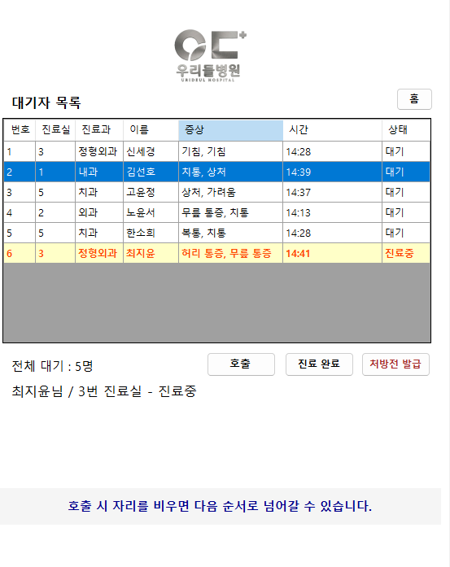

# 🏥 병원 키오스크 시스템


C# WinForms 기반의 병원 접수, 대기, 호출, 수납 기능을 통합한 키오스크 시스템입니다.

---

## 📌 프로젝트 소개
본 프로젝트는 병원 키오스크 환경을 가정하여,  
사용자가 직접 접수를 진행하고 진료과를 선택한 뒤, 대기 및 호출 상태를 확인할 수 있도록 구현한 프로그램입니다.

단순한 UI 구현을 넘어,  
대기열 관리 로직과 환자 데이터 처리 구조를 설계하여 실제 병원 운영 흐름을 반영했습니다.

---

## 📅 프로젝트 정보
- 개발 기간: 2026.02.19 ~ 2026.02.20
- 개발 형태: 개인 프로젝트

---

## 🧩 시스템 구성
- Kiosk UI (접수 / 대기 / 호출 / 수납)
- 환자 데이터 관리 시스템
- Queue 기반 대기열 관리 시스템

---

## 🔄 시스템 흐름
1. 사용자가 메인 화면에서 접수 또는 수납 선택  
2. 신규 / 기존 환자 여부에 따라 정보 입력 또는 조회  
3. 진료과 및 증상 선택  
4. 대기열 등록 및 대기 순서 자동 부여  
5. 호출 시 환자 상태를 진료중으로 변경  
6. 진료 후 처방전 확인  
7. 수납 진행 및 완료 처리  

---

## 🛠 개발 환경 및 기술 스택

| 구분 | 내용 |
|------|------|
| Language | C# |
| Framework | WinForms |
| IDE | Visual Studio |
| Data Structure | Queue, Dictionary |
| UI Component | DataGridView |

---

## 💡 주요 기능

### 📝 접수 기능
- 신규 / 기존 환자 구분 처리
- 이름 + 생년월일 기반 환자 조회
- 진료과 및 증상 선택 기능

### ⏳ 대기 관리 기능
- Queue 기반 FIFO 대기열 관리
- 진료과별 대기 목록 분리
- 실시간 대기 순서 및 인원 표시

### 📢 호출 기능
- 환자 호출 시 상태 변경 (대기 → 진료중)
- 진료실 안내 메시지 출력

### 📄 처방전 기능
- 환자 정보 기반 처방전 출력 화면 구성

### 💳 수납 기능
- 수납 대상 환자 목록 관리
- 결제 처리 기능 구현

---

## 👨‍💻 구현 내용
- Queue 자료구조를 활용한 대기열 관리 시스템 구현
- Dictionary를 활용한 환자 정보 저장 및 조회 처리
- DataGridView 기반 대기 목록 UI 구성
- 이벤트 기반 버튼 처리 및 사용자 인터랙션 구현
- Form 분리를 통한 기능별 화면 모듈화 (접수 / 대기 / 처방전 / 수납)

---

## ⚙️ 문제 해결 경험

### ⏳ 대기 순서 데이터 동기화 문제
- 대기 순서 관리 과정에서 데이터와 UI 상태가 일치하지 않는 문제가 발생
- Queue 자료구조를 활용하여 순서를 보장하고 처리 안정성을 확보

### 👤 기존 환자 조회 시 중복 데이터 문제
- 동일 환자 데이터 중복 등록 문제가 발생
- Dictionary를 활용하여 빠른 검색 및 데이터 중복 방지 구조 구현

### 🖥 UI 상태 불일치 문제
- 호출 상태 변경 시 일부 UI가 즉시 반영되지 않는 문제 발생
- 이벤트 기반 흐름 제어를 통해 UI 상태 동기화 처리

---

## 🧠 설계 포인트
- FIFO 구조를 통한 공정한 대기열 처리
- Dictionary 기반 빠른 환자 조회 구조 설계
- 이벤트 중심 UI 흐름 설계를 통한 사용자 편의성 확보

---

## 🚀 프로젝트 특징
- 단순 UI 구현이 아닌 자료구조 기반 대기열 시스템 직접 설계
- 실제 병원 프로세스를 반영한 접수 → 대기 → 호출 → 수납 흐름 구현
- 사용자 입력에 따라 동적으로 변화하는 UI 구성

---

## 📈 구현 결과 및 효과
- 환자 접수부터 대기, 호출, 수납까지 하나의 흐름으로 통합 구현
- Queue 기반 대기열 관리를 통한 공정한 순서 처리
- Dictionary 기반 환자 조회 속도 향상
- 사용자 입력에 따른 실시간 UI 업데이트 구현

---

## 📁 프로젝트 구조

```text
hospital-kiosk/
│
├── Form1.cs               # 메인 키오스크 화면
├── FormPrescription.cs    # 처방전 화면
├── WaitItem.cs            # 대기 데이터 클래스
├── Program.cs             # 실행 진입점
└── images/                # README 이미지 파일
```

---

## 🙋 담당 역할
- 전체 기능 설계 및 구현  
- WinForms UI 설계 및 구성  
- 대기열 관리 및 호출 기능 구현  
- 처방전 및 수납 화면 구성  

---

## 🔧 보완할 점
- 실제 DB 연동을 통한 데이터 관리 개선  
- 진료과별 기능 확장  
- 사용자 편의성을 고려한 UI/UX 개선  

---

## 🎥 시연 영상
시연 영상은 추후 업로드 예정입니다.

---

## 📷 실행 화면

### 📝 접수 화면
사용자가 접수 또는 수납 기능을 선택하는 메인 화면입니다.  


### ⏳ 대기 / 호출 화면
진료과별 대기 목록을 확인하고 환자를 호출 및 상태를 관리하는 화면입니다.  


### 📄 처방전 화면
진료 후 환자 정보를 기반으로 처방전 내용을 확인할 수 있는 화면입니다.  


### 💳 수납 화면
수납 대기 환자 목록을 확인하고 결제를 진행하는 화면입니다.  

